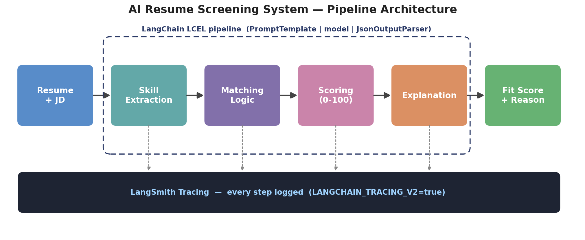

# AI Resume Screening System with Tracing — Project Report

**Author:** Yash
**Stack:** Python · LangChain (1.x) · LangSmith · OpenAI

---

## 1. Objective

Build an AI tool that screens resumes against a job description and returns a
**fit score (0–100) with an explanation**, implemented as a modular **LangChain**
pipeline and fully traced in **LangSmith** for debugging and monitoring.

## 2. Problem framing

```
Input    →  Resume + Job Description
Process  →  Skill Extraction + Matching + Scoring
Output   →  Fit Score + Explanation
```

The system is a recruiter aid: it reads a resume, compares it to the role's
requirements, scores the fit, and justifies that score in plain language.

## 3. Pipeline architecture

```
Resume → Skill Extraction → Matching → Scoring → Explanation → (Tracing)
```



The pipeline is a single LCEL composition built with `RunnablePassthrough.assign`,
where each stage adds its output to a shared state dictionary that later stages
read from:

| Stage | Input | Output (JSON) |
|-------|-------|---------------|
| **Extraction** | resume text | `skills, tools, years_of_experience, domains` |
| **Matching** | extraction + JD | `matched_required, missing_required, matched_preferred, experience_match` |
| **Scoring** | matching | `score (0–100), band` |
| **Explanation** | scoring + matching | `summary, reasoning, key_strengths, key_gaps` |

Each stage is its own `prompt | model | JsonOutputParser` chain, so it can be
tested and reasoned about in isolation — the essence of modular pipeline design.

## 4. LangChain implementation details

- **PromptTemplate** with explicit `input_variables` for every stage (in `prompts/`).
- **LCEL** (`|` pipe) composes prompt → model → parser; the full pipeline is
  itself a Runnable invoked with a single **`.invoke()`** call.
- **Structured JSON output** via `JsonOutputParser` (bonus).
- **Shared, swappable model** built once in `config.py` (`openai:gpt-4o-mini`,
  `temperature=0` for reproducibility).

## 5. Scoring logic

Scoring is **not hardcoded** — it is produced by the LLM from the matching
analysis, anchored by a 3-example **few-shot** block (bonus) and an explicit
banding guide:

- **80–100** Strong fit — most required skills + relevant experience
- **50–79** Partial fit — some required skills, notable gaps
- **0–49** Weak fit — missing most required skills / wrong domain

## 6. Explainability

The explanation stage is constrained to justify the score using **only** the
matched and missing skills, naming concrete strengths and gaps. This makes each
decision auditable by a hiring manager rather than a black-box number.

## 7. Prompt engineering & anti-hallucination

Every prompt enforces:

- Clear instructions and a strict output schema (JSON only).
- **"Use ONLY information explicitly present in the resume."**
- **"Do NOT assume, infer, or invent any skill not stated"** — the mandatory
  rule that the model must not credit skills absent from the resume.

## 8. LangSmith tracing (mandatory)

Tracing is enabled by setting in `.env`:

```
LANGCHAIN_TRACING_V2=true
LANGCHAIN_API_KEY=...
LANGCHAIN_PROJECT=resume-screening-system
```

`main.py` screens **three candidates** (strong / average / weak), producing the
required **3 runs**. Each `.invoke()` passes a `config` with a `run_name`, **tags**
(`strong`/`average`/`weak` — bonus) and metadata, so runs are easy to find and
compare. Because the whole pipeline is LCEL, **every step** (extract → match →
score → explain) appears as a nested span in each trace.

### Required screenshots (add these before submitting)

> Run `python main.py` with tracing on, then paste your screenshots here.

1. **`screenshot_runs_list.png`** — the project's run list showing the 3 tagged runs.
2. **`screenshot_strong_trace.png`** — the strong candidate run expanded to show
   all 4 pipeline steps.
3. **`screenshot_debug_case.png`** — a run where the output was wrong/borderline
   (see Debugging below), showing how the trace exposes the faulty step.

## 9. Debugging case (required: at least one incorrect output)

A realistic failure: the **average candidate** lists *"basic scikit-learn"*. An
early version of the extraction prompt promoted this to a full *"Machine Learning"*
skill, which inflated the matching step and pushed the score too high. The
LangSmith trace made this visible — opening the **extraction span** showed the
over-generous skill list feeding the matching step. The fix was tightening the
extraction prompt's anti-hallucination rule ("use only skills explicitly stated,
preserve qualifiers like *basic*"). Document your own equivalent case with the
`screenshot_debug_case.png` above.

## 10. How to reproduce

```bash
pip install -r requirements.txt
cp .env.example .env          # add your OpenAI + LangSmith keys
python main.py                # 3 traced runs -> results.json
python tests/test_pipeline_offline.py   # offline wiring check (no key needed)
```

## 11. Evaluation mapping

| Criterion | Where it's addressed |
|-----------|----------------------|
| Pipeline Design (20%) | 4-stage LCEL pipeline, `chains/pipeline.py` |
| LangChain Implementation (20%) | PromptTemplate + LCEL + `.invoke()`, modular `prompts/`,`chains/` |
| Scoring & Logic (15%) | `scoring_prompt.py` with banding + few-shot |
| Explainability (15%) | `explanation_prompt.py`, strengths/gaps/reasoning |
| LangSmith Tracing (15%) | `config.py` + per-run tags in `main.py`, §8–9 |
| Code Quality (10%) | modular structure, comments, offline test |
| Bonus (5%) | JSON output, few-shot, LangSmith tags |

## 12. Key takeaway

This project moves from *using prompts* to *engineering a traceable, modular LLM
system* — with explicit anti-hallucination constraints, explainable scoring, and
full observability through LangSmith.
